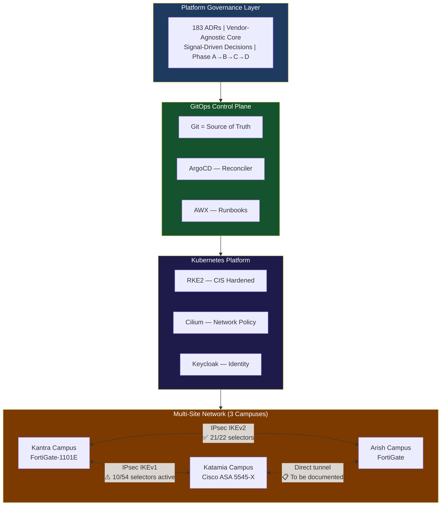

# LinkedIn Post 01: Multi-Site University Platform Architecture

**Target Audience:** Platform engineers, infrastructure architects, university IT leaders  
**Post Length:** ~280 words  
**Diagram Type:** Platform stack + multi-site topology  

---

## Post Text

Most infrastructure projects fail at the same point: the moment you add the second site.

Site 1 is documented. Site 2 is "similar to site 1, but different." Site 3 is where the technical debt becomes visible.

At Sinai University, I was given 3 campuses with different hardware maturity levels, a mixed-skill ops team, and a mandate to build something a university governance board could audit. No cloud. No blank-check procurement. Just the gear already in place and a commitment to do it properly.

The architecture decision that changed everything: **separate what the platform believes from what the platform runs on.**

The Nexus Platform Core defines 183 Architecture Decision Records — all vendor-agnostic. No tool names. Just capability contracts: "Firewall Control Plane", "Identity Broker", "GitOps Reconciler."

The Sinai University Product implements those contracts. FortiGate satisfies the firewall contract. RKE2 satisfies the Kubernetes contract. Keycloak brokers identity from Active Directory into every platform service.

When we added the third campus, we didn't rebuild the governance. We instantiated the same contracts with the same principles. The platform scaled by design, not by accident.

The full-mesh IPsec VPN (FortiGate at each site, BGP routing between all 3) was the network architecture decision that enabled this. Every site talks directly to every other site — no Main Campus as a hub, no single point of failure for inter-site AD replication or vMotion traffic.

Build the governance first. Then build the infrastructure.

---

## Diagram

---

## Notes for Human Review
- [ ] Katamia-site vendor (Cisco ASA) can be removed if not for public disclosure
- [ ] VPN partial status (10/54) is accurate as of Dec 2025 — update if resolved
- [ ] Consider anonymizing "Sinai University" to "Multi-site University" for privacy
- [ ] LinkedIn image: render diagram as PNG, attach separately; post text stands alone
