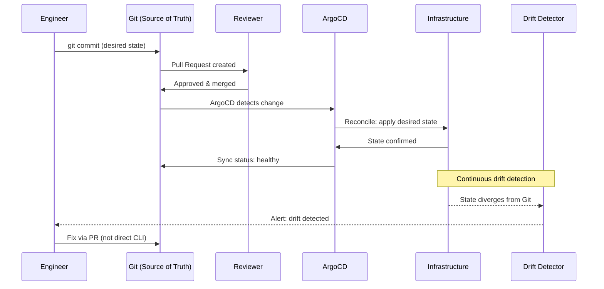

# LinkedIn Post 02: GitOps as Infrastructure Control Plane

**Target Audience:** Platform engineers, DevOps engineers, SREs, engineering managers  
**Post Length:** ~270 words  
**Diagram Type:** GitOps workflow sequence  

---

## Post Text

The 40-minute outage had no post-mortem. Not because no one cared — because no one could answer the question: who changed this, and what was the previous state?

That is the real cost of infrastructure that lives only in human memory.

The fix isn't cultural. It's architectural. When you make Git the control plane — not just a backup of configs, but the authoritative source of truth that automation reads and enforces — you get auditability by construction, not by process.

Every change is a commit. Every commit has an author. Every deployment is a reconciliation of desired state to actual state. Drift is detected automatically. Rollback is `git revert`.

At Sinai University, ArgoCD continuously reconciles 3-site Kubernetes state from Git. Ansible/AWX manages all switch configurations from Git-committed playbooks. Terraform manages infrastructure from Git-committed plans.

The university governance requirement for audit trails? Satisfied by the Git commit history. No additional tooling needed.

The key insight: **GitOps is a governance decision before it is a tooling decision.** The tool (ArgoCD, Flux) doesn't matter if you allow direct CLI changes to coexist. The moment you permit out-of-band changes, you have GitOps theater — the overhead without the auditability.

All-or-nothing. Git is truth. Drift from Git state is an incident, not a feature.

---

## Diagram

---

## Notes for Human Review
- [ ] The 40-minute outage reference is real — confirm comfort with including it
- [ ] "All-or-nothing" framing is intentionally strong — adjust if preferred softer
- [ ] Can add specific repo names (su_gitops_project, network-automation-aruba) for technical audiences
