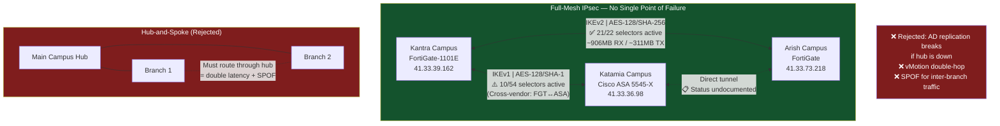

# LinkedIn Post 03: Full-Mesh VPN Architecture

**Target Audience:** Network architects, platform engineers, university/enterprise IT  
**Post Length:** ~260 words  
**Diagram Type:** VPN mesh topology  

---

## Post Text

Hub-and-spoke is the default network topology because it's the simplest to draw on a whiteboard.

It's also the topology that makes your resilience dependent on the availability of a single site.

At Sinai University, the initial proposal was hub-and-spoke with Main Campus as the hub. Branch 1 and Branch 2 would route all inter-site traffic through Main Campus.

I rejected it. Here's why.

Active Directory replication between Branch 1 and Branch 2 would break if Main Campus had an outage. VMware vMotion between branch sites would double-hop through the hub — bandwidth degradation guaranteed. And the "backup" tunnel architecture we'd need to compensate would be more complex than just building full-mesh in the first place.

Full-mesh IPsec with BGP routing between all 3 sites. 3 tunnels. Each site talks directly to every other site.

Two months after deployment, Main Campus had a 4-hour ISP outage. Branch 1 and Branch 2 continued operating normally. AD replication held. No escalation. The design paid for itself.

The decision criterion for topology choice: **would a single-site outage cascade to other sites?** If yes, full-mesh. The BGP configuration overhead is a one-time cost. The resilience is continuous.

At 5+ sites, re-evaluate — N*(N-1)/2 tunnels becomes operationally complex. At 3 sites, the math is easy: 3 tunnels, full resilience.

---

## Diagram

---

## Notes for Human Review
- [ ] IP addresses shown are real from Kantra-site config — anonymize if preferred
- [ ] IKEv1/SHA-1 on Cairo-S2S is accurate (cross-vendor constraint) — this is an honest technical detail, but may want to note it's under remediation
- [ ] The "4-hour outage" story is the payoff — keep it specific
- [ ] Katamia↔Arish shown as undocumented (accurate) — can be simplified if preferred
