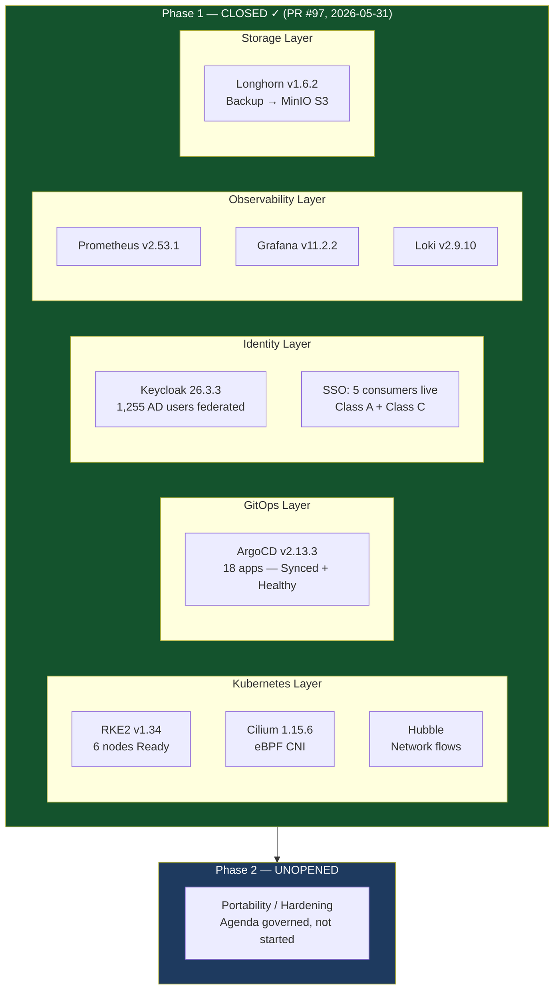

# LinkedIn Post 04: Phase 1 Closed — What a Governed Platform Foundation Looks Like

**Target Audience:** Platform engineers, SREs, infrastructure architects, engineering managers  
**Angle:** The platform story — what was built, what it took, what honest closure means  
**Post length:** ~320 words

---

## Post Text

Phase 1 of the Nexus Platform at Sinai University is closed.

Not "mostly done." Not "good enough." Closed against 14 documented criteria, each with a traceable evidence pack.

Here's what that means in practice:

**What's running:**
- RKE2 Kubernetes cluster — 6 nodes, all Ready
- ArgoCD managing 18 applications — all Synced, all Healthy
- Keycloak federated to Active Directory — 1,255 users, LDAPS, no shadow stores
- SSO live across 5 platform consumers: ArgoCD, Grafana, Longhorn UI, Alertmanager UI, Hubble UI
- Full observability stack: Prometheus, Grafana, Loki, Alertmanager, Hubble
- Longhorn storage with MinIO S3 backup — backup chain operational, isolated restore drill proven
- Gateway API ingress with internal PKI — cert-manager issuing, trust-manager distributing
- Full-mesh IPsec VPN across 3 campus sites — no hub, no single point of failure

**What "closed" actually means:**
Every platform change went through a Pull Request. Every decision has an ADR. Every service has an SLO. The governance model is in the repository, not in someone's head.

When an AD LDAPS CA re-key incident hit during operations, we resolved it under the same governed evidence model — diagnosed, contained, and closed with a dated incident report. That's not a story about incident response tooling. It's a story about what a platform with a real governance model looks like when something goes wrong.

**What it's not:**
Not portable yet. Not security-hardened for production at scale. Not a commercial product. Those are Phase 2 problems — and I know exactly what they are because we documented them.

The honest boundary is the credential: a foundation reference implementation that does what it claims, knows what it doesn't, and has the evidence to tell the difference.

Phase 2 agenda is governed and recorded. Not opened yet.

The work is on GitHub.

---

## Diagram

---

## Notes for Human Review
- [ ] Confirm comfort with "not security-hardened" framing — accurate per source but direct
- [ ] The AD LDAPS incident reference is accurate (docs/reports/2026-06-03-keycloak-ad-ldaps-truststore-remediation-closure.md) — decide if you want to include or remove
- [ ] "Phase 2 agenda is governed and recorded. Not opened yet." — intentionally creates forward tension; adjust if preferred
- [ ] GitHub link: add your portfolio repo URL at the end
