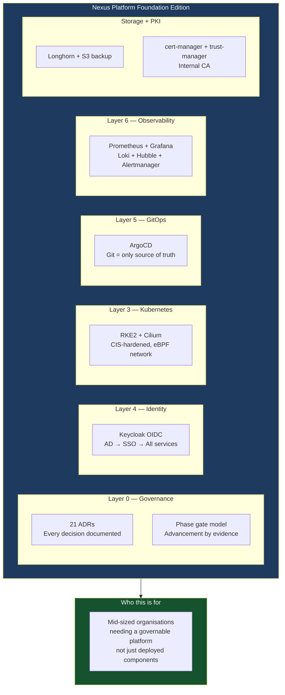

# LinkedIn Post 05: Nexus Platform Foundation Edition — What the Product Is

**Target Audience:** CTOs, VPs Engineering, platform product managers, infrastructure decision-makers  
**Angle:** The product story — what Nexus Foundation Edition is, what it's for, what it's not  
**Post length:** ~300 words

---

## Post Text

There's a class of infrastructure problem that every mid-sized organization hits at some point.

You have good engineers. You have reasonable hardware. You have a Kubernetes cluster or two. But you don't have a platform — you have components that happen to share a network.

No unified identity. No governed change model. No observability that tells you *why* something broke, not just *that* it broke. No phase model that tells you what the platform can reliably promise today, and what it's not ready for yet.

That's the problem the Nexus Platform Foundation Edition is built to solve.

**What it is:**
A governed Kubernetes-based platform foundation. RKE2 as the runtime. ArgoCD as the single change authority — Git is truth, everything else reconciles to it. Keycloak bridging Active Directory to OIDC so every platform service shares one identity layer without one team having to configure LDAP six times. Prometheus, Grafana, Loki, and Hubble as a coherent observability stack, not four independent tools. Longhorn with S3 backup. Internal PKI with cert-manager and trust-manager distributing CA bundles automatically.

All of it managed via Pull Requests. All decisions documented as Architecture Decision Records. Every phase advancement requiring evidence, not a calendar.

**What it's for:**
Organizations that need a platform that can be reasoned about — by the engineers who operate it, by the management that funds it, and by the governance structures that need to audit it.

**What it's not:**
It's not a one-size-fits-all product. The Sinai University deployment is a reference implementation, not a template. Phase 2 is portability — building the customer overlay extraction that makes this installable elsewhere. That work is scoped and sequenced. It's not open yet.

Foundation first. That's the discipline.

---

## Diagram

---

## Notes for Human Review
- [ ] "Foundation Edition" is the correct product name per the strategy decision record — not "v1.0" (that label refers to Phase 7 in the internal roadmap, which is different)
- [ ] "Reference implementation, not a template" is accurate per §4 non-claims — portability is Phase 2
- [ ] The "four independent tools" line about observability is a pointed characterisation — keep if the tone feels right
- [ ] Add GitHub repo link at the end
