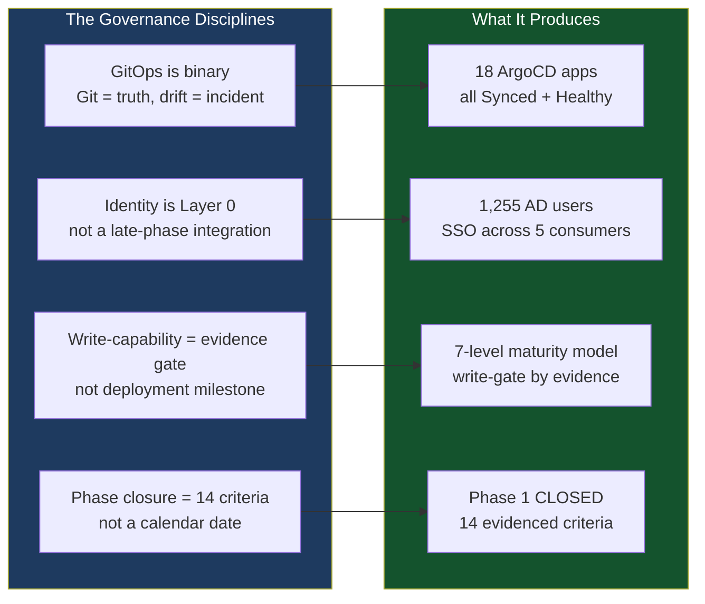

# LinkedIn Post 06: What Governed Platform Engineering Actually Looks Like

**Target Audience:** Senior/Principal platform engineers, engineering leaders, anyone building internal platforms  
**Angle:** The craft story — the discipline behind the platform, the Principal-level signals  
**Post length:** ~280 words

---

## Post Text

Most platform engineering stories go like this: we deployed X, migrated to Y, scaled to Z.

I want to tell a different story.

Over the last year I built a governed Kubernetes platform for a 3-site university — 5,800 users, mixed hardware maturity, a 4-person ops team, and a governance board that needed to audit every infrastructure change.

Here's what I learned about what "governed" actually means in practice.

**GitOps is a governance decision, not a tool choice.**
The moment you allow one direct CLI change to coexist with GitOps, you have GitOps theater. The overhead without the auditability. We made it binary: Git is truth, everything else is drift. ArgoCD detects drift. Drift is an incident.

**Identity architecture is not a late-phase concern.**
We federated 1,255 Active Directory users into Keycloak on LDAPS, mapped groups to platform RBAC claims, and deployed SSO across 5 platform consumers — including three that have no native OIDC support (solved with oauth2-proxy). Every platform service authenticates through one identity boundary. No local users. No shadow accounts.

**Write-capability on infrastructure is a maturity gate, not a deployment decision.**
Deploying Terraform doesn't mean Terraform should run `apply` against production. We built a 7-level Capability Maturity Model: observed → backup-enabled → read-only-inventory → safe-write → controlled-write → full-managed. Write-capable levels require Human Owner approval and an evidence pack. Not a calendar. Not a sprint. Evidence.

**Phase gates without evidence are decoration.**
Phase 1 closed against 14 documented criteria. Each one has a traceable evidence pack in the repository. "Closed" means something specific, or it means nothing.

The full architecture, 21 ADRs, and governance models are on GitHub.

This is what principal-level platform engineering looks like when you treat governance as a first-class engineering concern.

---

## Diagram

---

## Notes for Human Review
- [ ] "GitOps theater" is a pointed phrase — effective but direct; keep if tone feels right
- [ ] The oauth2-proxy detail (Class C SSO consumers) is accurate and technically interesting for the engineering audience
- [ ] "This is what principal-level platform engineering looks like" — assertive close; adjust if preferred
- [ ] Add GitHub portfolio link at the end
- [ ] Decide posting order: recommend Post 06 first (craft story), then Post 04 (closure), then Post 05 (product) — builds from personal to professional to product
