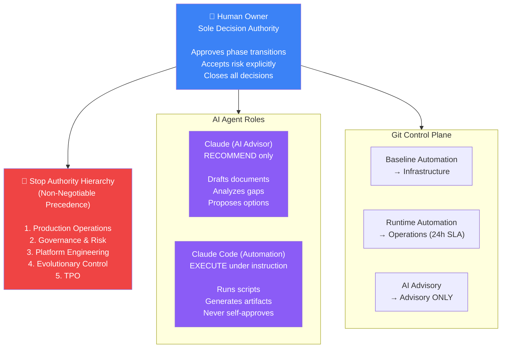
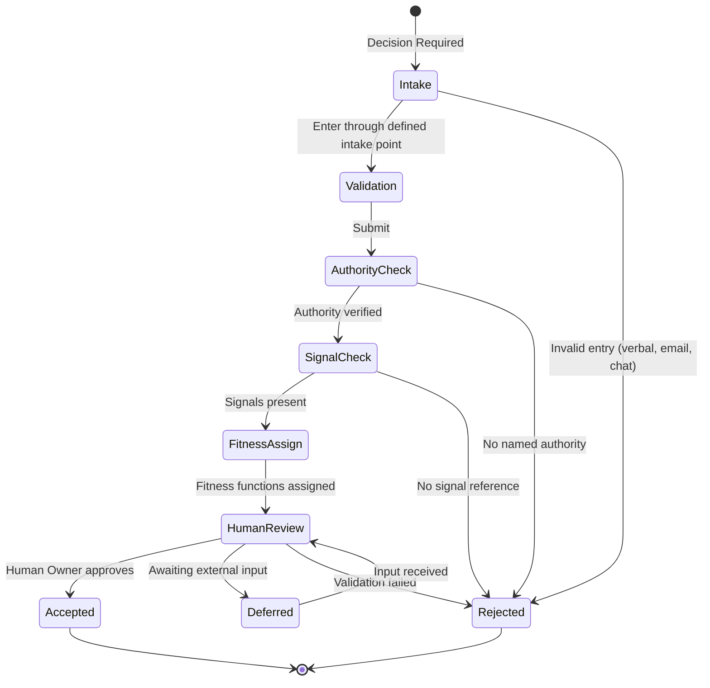
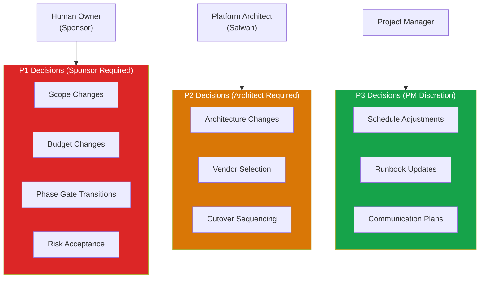

# System Diagram: Governance Authority Model

> Who can decide what, at each layer of the Nexus Platform System.

## Authority Hierarchy

---

## Core / Product Authority Boundary

```mermaid
graph LR
    subgraph CORE["Nexus Platform Core\n(Immutable)"]
        PRINC["Principles"]
        ADR["183 ADRs"]
        GOV["Governance Models"]
        PHASES["Phase Definitions"]
        CAP["Capability Contracts"]
    end
    
    subgraph PRODUCT["Product Implementation\n(Disposable)"]
        VENDORS["Vendor Selections"]
        CONFIG["Tool Configurations"]
        ENV["Environment Specifics"]
        OPS["Operational Procedures"]
        MANIFESTS["Deployment Manifests"]
    end
    
    CORE -->|"Authority flows ONE WAY"| PRODUCT
    PRODUCT -.->|"Cannot override Core"| CORE
    
    style CORE fill:#1e40af,color:#fff
    style PRODUCT fill:#065f46,color:#fff
```

---

## Decision Lifecycle

---

## DC Migration Governance Model

