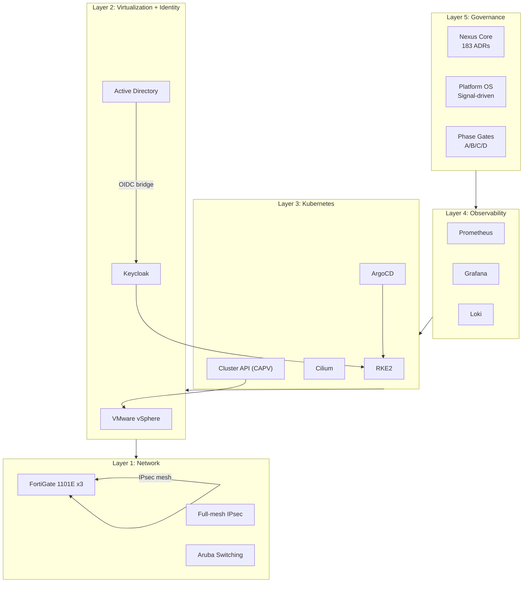

# System Diagram: Nexus Platform Layers
## Sinai University Implementation

```
┌──────────────────────────────────────────────────────────────────────────────┐
│                                                                              │
│  LAYER 5: GOVERNANCE                                                         │
│  ┌─────────────────┐ ┌─────────────────┐ ┌─────────────────┐ ┌────────────────┐  │
│  │ Nexus Core      │ │ 183 ADRs        │ │ Platform OS     │ │ Phase Gates    │  │
│  │ (doctrine)      │ │ (decisions)     │ │ (enforcement)   │ │ (advancement)  │  │
│  └─────────────────┘ └─────────────────┘ └─────────────────┘ └────────────────┘  │
│                                                                              │
├──────────────────────────────────────────────────────────────────────────────┤
│                                                                              │
│  LAYER 4: OBSERVABILITY (8 Axes)                                             │
│  ┌─────────┐ ┌─────────┐ ┌─────────┐ ┌─────────┐ ┌─────────┐ ┌─────────┐ ┌────────┐ ┌────────┐  │
│  │ Infra   │ │ App     │ │ Svc     │ │ Incident│ │ Portfolio│ │ Platform│ │ FinOps │ │ BizOps │  │
│  │ Health  │ │ Metrics │ │ Health  │ │ Track   │ │ Catalog  │ │ Sync    │ │ Cost   │ │ KPIs   │  │
│  └─────────┘ └─────────┘ └─────────┘ └─────────┘ └─────────┘ └─────────┘ └────────┘ └────────┘  │
│         Prometheus + Grafana + Loki                                          │
│                                                                              │
├──────────────────────────────────────────────────────────────────────────────┤
│                                                                              │
│  LAYER 3: WORKLOAD / KUBERNETES                                              │
│  ┌──────────────────────────────────────────────────────────────────────────┐  │
│  │  RKE2 (Kubernetes Distribution)                                        │  │
│  │  ┌─────────────┐ ┌─────────────┐ ┌─────────────┐ ┌─────────────┐  │  │
│  │  │ ArgoCD      │ │ Cilium       │ │ Tekton       │ │ Cluster API │  │  │
│  │  │ (GitOps)    │ │ (eBPF CNI)   │ │ (Pipelines)  │ │ CAPV (vSphere│  │  │
│  │  └─────────────┘ └─────────────┘ └─────────────┘ └─────────────┘  │  │
│  └──────────────────────────────────────────────────────────────────────────┘  │
│                                                                              │
├──────────────────────────────────────────────────────────────────────────────┤
│                                                                              │
│  LAYER 2: VIRTUALIZATION + IDENTITY                                         │
│  ┌───────────────────────┐ ┌────────────────────────────────────────┐  │
│  │ VMware vSphere         │ │ Active Directory → Keycloak          │  │
│  │ (Virtualization Layer) │ │ (Legacy IdP)     (OIDC Broker)       │  │
│  │ CAPV manages k8s nodes │ │                                         │  │
│  └───────────────────────┘ └────────────────────────────────────────┘  │
│                                                                              │
├──────────────────────────────────────────────────────────────────────────────┤
│                                                                              │
│  LAYER 1: NETWORK FOUNDATION                                                │
│  ┌──────────────────┐ ┌──────────────────┐ ┌────────────────────────────┐  │
│  │ FortiGate 1101E  │ │ Full-mesh IPsec  │ │ Aruba campus switching         │  │
│  │ (Edge firewall   │ │ (Kantra↔Arish↔  │ │ AWX-automated Ansible          │  │
│  │  at each site)   │ │  Katamia)        │ │ VLAN segmentation per site     │  │
│  └──────────────────┘ └──────────────────┘ └────────────────────────────┘  │
│                                                                              │
└──────────────────────────────────────────────────────────────────────────────┘
```

## Key Architectural Properties

| Property | Implementation |
|----------|---------------|
| **GitOps-first** | All state declared in Git; ArgoCD reconciles continuously |
| **Zero-trust boundary** | Cilium network policy; Keycloak OIDC; FortiGate UTM |
| **Branch autonomy** | Full-mesh VPN; local internet breakout; no datacenter dependency |
| **Phase-gated** | Phase A active; Phase B partial; advancement requires gate approval |
| **Evidence-based** | 197 ADRs; all configuration in version control |
| **Observable** | 8-axis observability framework: Prometheus + Grafana + Loki |

## Mermaid Diagram


