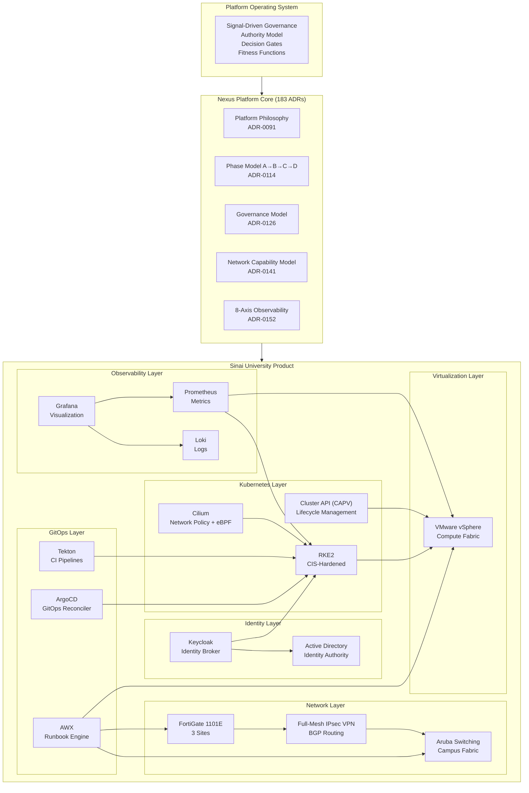
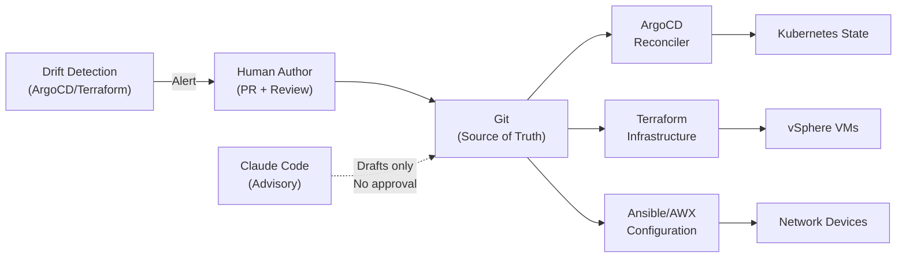
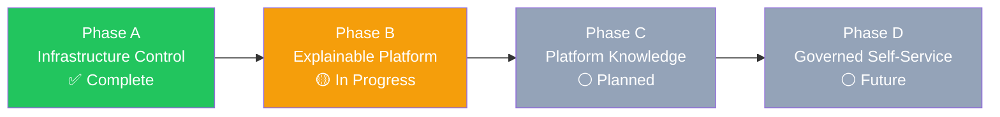
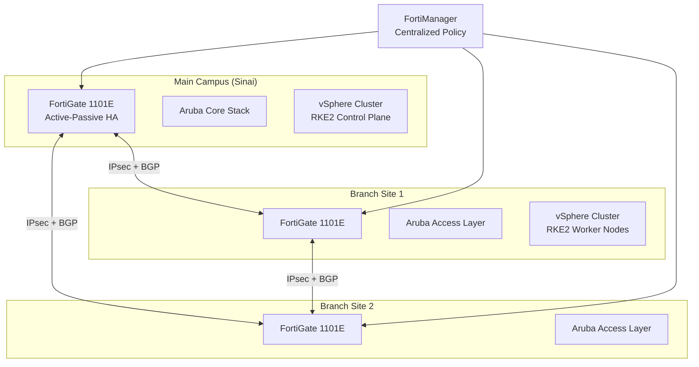
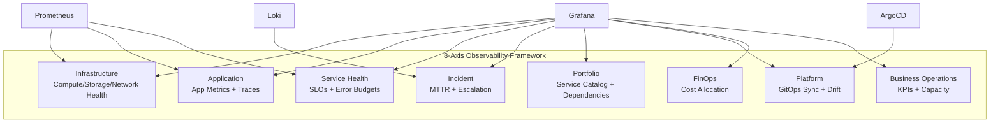

# System Diagram: Nexus Platform Full Stack

> Architecture-as-code diagram using Mermaid. Render in GitHub or any Mermaid-compatible viewer.

## Platform Layer Model

---

## Authority Flow Diagram

---

## Phase Maturity Model

---

## Multi-Site Topology

---

## Observability Framework (8 Axes)

