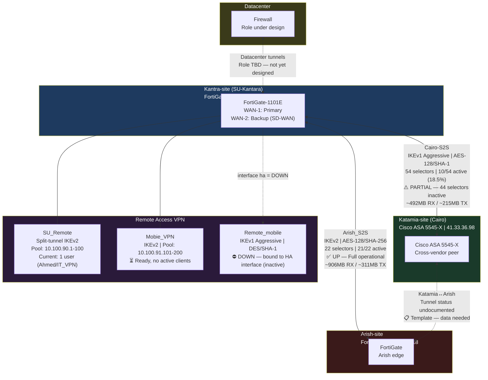
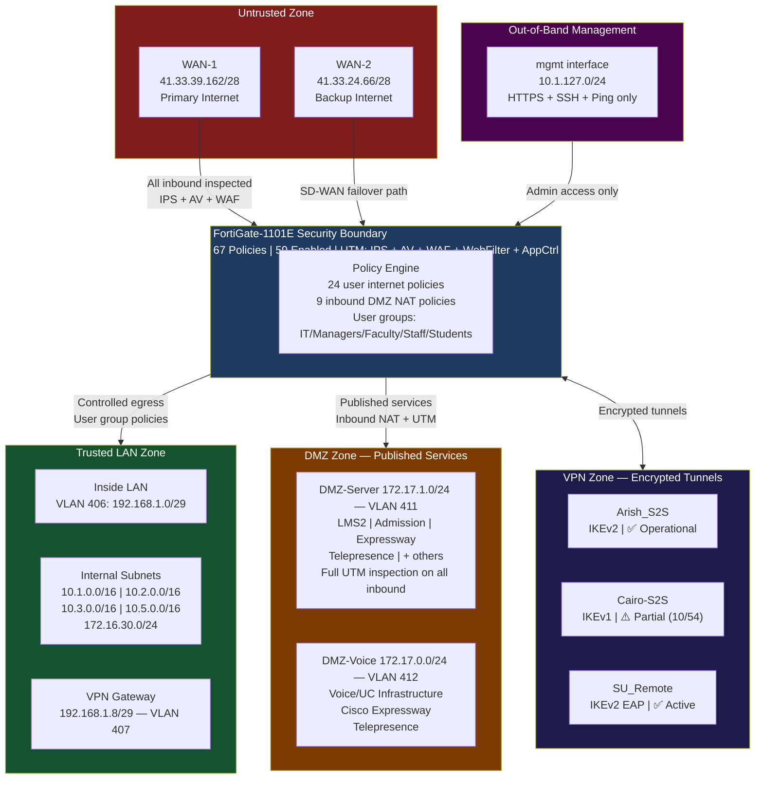
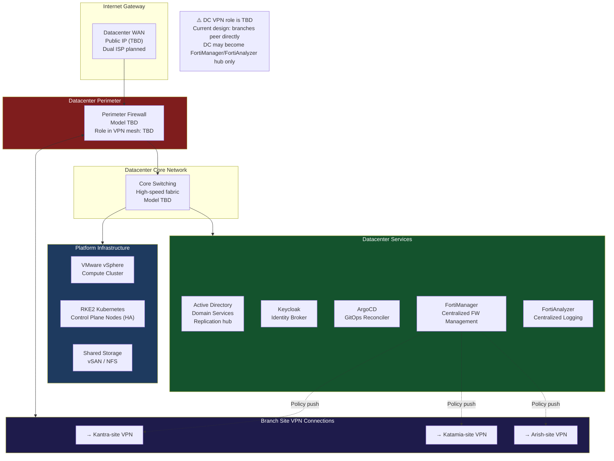
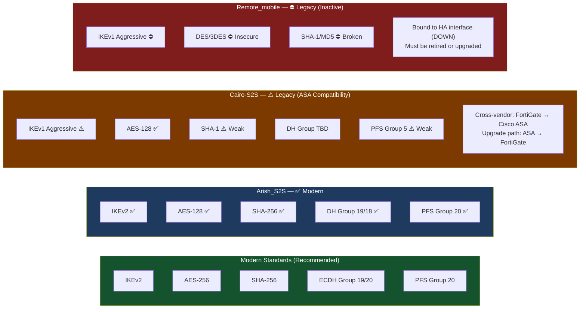

# System Diagrams: University Network Architecture

> Source: `university-network-architecture` repository  
> Generated by: Diagram Agent  
> Last updated: 2026-03-05  
> Data currency: Kantra-site live (Dec 28, 2025); Katamia/Arish templated

---

## Diagram 1: Multi-Site Network Topology

```mermaid
graph TB
    subgraph INTERNET["Internet (Public)"]
        ISP["ISP Infrastructure"]
    end

    subgraph KANTRA["Kantra-site — SU-Kantara (Main Campus)"]
        FGT_K["FortiGate-1101E\nv7.6.4 | SU-Kantara\n9 interfaces active / 34 total"]
        LAG_INSIDE["Inside LAG\nport2-5 (4 ports)"]
        LAG_DMZ["DMZ LAG\nport6-7 (2 ports)"]
        LAG_SS["Site-Site LAG\nport8-9 (2 ports)"]
        subgraph KANTRA_NETS["Internal Networks"]
            LAN_K["LAN 192.168.1.0/29\nVLAN 406"]
            VPNGW_K["VPN GW 192.168.1.8/29\nVLAN 407"]
            DMZ_SRV_K["DMZ-Server 172.17.1.0/24\nVLAN 411 | 9 published services"]
            DMZ_VOICE_K["DMZ-Voice 172.17.0.0/24\nVLAN 412"]
            MGMT_K["Management 10.1.127.0/24"]
        end
        WAN1_K["WAN-1 41.33.39.162/28\nVLAN 401 — Primary"]
        WAN2_K["WAN-2 41.33.24.66/28\nVLAN 402 — Backup"]
    end

    subgraph KATAMIA["Katamia-site — Cairo (Branch)"]
        FGT_KAT["Cisco ASA 5545-X\nKatamia Edge Firewall"]
        subgraph KATAMIA_NETS["Internal Networks"]
            LAN_KAT["LAN 10.128.0.0/16"]
            DMZ1_KAT["DMZ 172.21.0.0/24"]
            DMZ2_KAT["DMZ 172.22.0.0/24"]
            DMZ3_KAT["DMZ 172.23.0.0/24"]
            DMZ4_KAT["DMZ 172.24.0.0/24"]
            VPNGW_KAT["VPN GW 192.168.12.0/28"]
        end
        WAN_KAT["WAN 41.33.36.98\nPublic IP"]
    end

    subgraph ARISH["Arish-site (Remote Branch)"]
        FGT_A["FortiGate\nArish Edge Firewall"]
        subgraph ARISH_NETS["Internal Networks"]
            LAN_A["LAN 10.64.0.0/16"]
            DMZ1_A["DMZ 172.30.0.0/24"]
            DMZ2_A["DMZ 172.30.10.0/24"]
            DMZ3_A["DMZ 172.35.0.0/24"]
            VPNGW_A["VPN GW 192.168.14.64/28"]
        end
        WAN_A["WAN 41.33.73.218\nPublic IP"]
    end

    subgraph DC["Datacenter (Role TBD)"]
        FGT_DC["Firewall\nRole in VPN TBD"]
    end

    ISP --- WAN1_K
    ISP --- WAN2_K
    ISP --- WAN_KAT
    ISP --- WAN_A

    WAN1_K --- FGT_K
    WAN2_K --- FGT_K
    FGT_K --- LAG_INSIDE
    FGT_K --- LAG_DMZ
    FGT_K --- LAG_SS
    LAG_INSIDE --- LAN_K
    LAG_INSIDE --- VPNGW_K
    LAG_DMZ --- DMZ_SRV_K
    LAG_DMZ --- DMZ_VOICE_K

    WAN_KAT --- FGT_KAT
    FGT_KAT --- LAN_KAT
    FGT_KAT --- DMZ1_KAT

    WAN_A --- FGT_A
    FGT_A --- LAN_A
    FGT_A --- DMZ1_A

    style KANTRA fill:#1e3a5f,color:#fff
    style KATAMIA fill:#1a3a2a,color:#fff
    style ARISH fill:#3a1a1a,color:#fff
    style DC fill:#3a3a1a,color:#fff
    style INTERNET fill:#2a2a2a,color:#fff
```

---

## Diagram 2: Full-Mesh VPN Architecture

---

## Diagram 3: Security Zone Architecture (Kantra-site)

---

## Diagram 4: Datacenter Network Architecture (Target State)

---

## Diagram 5: VPN Encryption Standards Comparison

